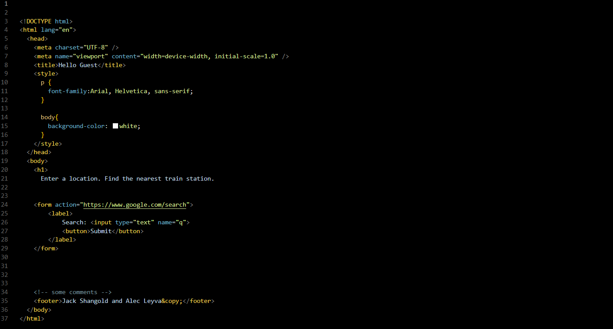
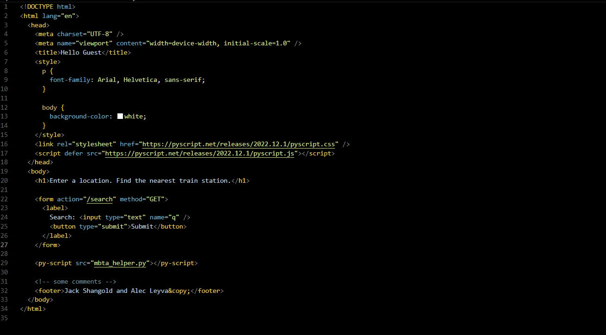

Jack Shangold and Alec Leyva

Project Overview

Reflection

1.
We made it a large priority of ours throughout this project to be constantly testing portions of code. We did this for two reasons. The first was to make sure that small pieces worked individually before combining them. Second, with us still being new to the push/pull system of working together, we wanted to always make sure that lines of code were not being conflicted when fetched. We do believe that we severely misjudged which parts of this project would take the longest. We finished the majority of the Python code far in advance of the deadline, thinking that the rest of the project would be fast (based on how long it had taken us to that point), then slowly realized how much work the connecting the dots would be. Looking back, we should have kept pressing hard. We got a little over-confident. We did work well together though, communicating properly, and getting started early.

2.
This was both of our first times working with someone else using Visual Studio Code, so much of our first meeting was simply seeing how the process of pushing and fetching works. We made a couple mistakes at the beginning that actually deleted previous work due to the order of the pushes. This caused us to establish a method of working together. We tried to put emphasis on us meeting together, with one laptop doing the actual coding and the other doing research and looking at instructions. We were able to meet in person for about half of the total work. For the rest, we just made sure that we weren't on VS Code at the same time by simply texting everytime we opened the code and when we pushed to Github. Due to this method, whenever one of us jumped on, we would usually just continue where the other person left off. The only time we truly assigned roles was when we got to the last two functions and the HTML work, which we split up. All in all, things went very well from a teamwork standpoint; work was divided evenly and after learning the push-pull system, no issues came up. One thing that we feel we could have done differently is leaving more descriptions of what was previously done in comments so the next person can read and understand it better.

3.
Throughout this project, we learned a lot about working with APIs and integrating HTML with Python. Overall, we didn't use ChatGPT that much for this project. We really only used it for debugging. For example, we used it to discover that we were not getting any responses at some point because our longitude and our latitudes were flipped. For the most part, we used the API instructions and the instructions provided by you. At some point, we did get stuck on connecting the HTML to the Python code and tried using Pyscript from https://blog.logrocket.com/pyscript-run-python-browser/#creating-index-html-file unsuccessfuly, before returning to using Flask. Here is the link with the conversation on Chat GPT trying to connect them: https://chat.openai.com/share/902e6174-79f3-4817-83ce-45e390327525. We wish that we had a larger understanding of the interaction between Python and HTML through Flask before this project. We apologize that we forgot to take screenshots for the first half of the project, but below are some from us working on connecting Python and HTML. It starts with what is mainly comprised of sample code, then takes us to us trying Pyscript, and finally to our steps with Flask.

